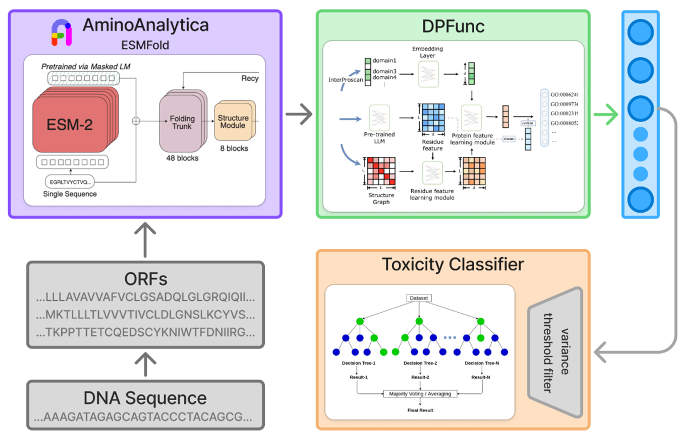

# SafeFold

**SafeFold** is a biosecurity screening pipeline that evaluates DNA or protein sequences for potential toxic activity before synthesis.

The system analyzes genetic constructs and estimates whether they encode proteins with **potential toxic biological function**, helping DNA synthesis companies and researchers screen constructs before ordering or producing them.

The pipeline combines classical bioinformatics with deep learning:

1. **ORF Detection** – detects proteins encoded in DNA sequences
2. **Structure Prediction** – predicts 3D structures from protein sequences
3. **Function Prediction (DPFunc)** – predicts Gene Ontology (GO) molecular functions
4. **Toxicity Classification** – estimates toxicity probability using a trained ML model

The output is a **toxicity probability score for each detected protein**. The current model is limited to detecting β-neurotoxins.

## Pipeline Overview

<p align="center">
  
  <br>
  <em>Overview of the SafeFold screening pipeline.</em>
</p>

## Installation

The easiest way to install SafeFold is using the provided `setup.sh`.

### 1. Clone the repository

```bash
git clone https://github.com/YOUR_USERNAME/SafeFold.git
cd SafeFold
```

### 2. Running setup script

In the anaconda terminal run, this may take up to 30 mins because of model download:

```bash
bash setup.sh
```

After that activate the environment:

```bash
conda activate SafeFold
```

### 3. Authenticate with your Amina CLI

In the anaconda terminal run the following providing your API key:

```bash
amina auth set-key "YOUR_API_KEY"
```

You can obtain an API key at:

```
https://app.aminoanalytica.com/settings/api
```

After this you are ready to go!

## Running SafeFold

You can provide youre DNA/AA sequences in `sequences.fasta`. An example is provided.

To run SafeFold you can just run the following command (`--AA` tag to specify aminoacid sequences).

```bash
python SafeFold.py sequences.fasta --AA
```

---
